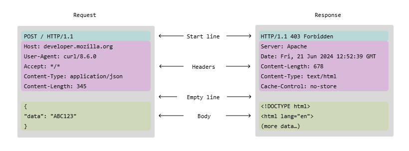

## What is an HTTP SERVER? 
**An Http Server is basically a piece of software that understands URLS AND HTTP protocol. It exists with the sole intention of delivering to the user the content stored inside it using URLs as the way of accessing them**
### What does it do?
**Its whole deal is to receive a request from a browser or whatever thing is capable of making a request asking for information/files stored in the physical web server then this software will try to retrieve the requested file, this whole communication occurs utilizing the HTTP protocol**

## What is the HTTP PROTOCOL?
**Hypertext Transfer Protocol or HTTP is a protocol of the application layer (the 4th of the tcp/ip stack). It was designed to allow clients like browsers communicate with servers. The model it follows is simply composed of a client and a server, the first one sends a request to the latter and awaits for a response. It is a stateless protocol so no state-info is stored between two requests**

HTTP is typically built on top of TCP, though newer versions (like HTTP/3) use QUIC over UDP.
The transport layer is a layer of the OSI model that is responsible of the end-to-end communication of data packets. When information is sent through any transport layer protocol the protocol breaks down the information into packets to be sent and reassembled into the original information piece when they reach the other end.
We can imagine this process like this:

Lets say you want to send a giant robot from california to arizona. the robot is 100 meters tall and you must use a truck that travels thru a road tunnel. Obviously you cant fit the 100 meter tall, multiple-tons of weight robot in a truck. so you break down the robot into pieces that fit in a truck and you send various trucks enough to ship the whole robot to arizona, when all the pieces are there, it gets reassembled.

There are two types of web servers
static web servers and dynamic web servers, for this video we will be building a static web server.
From mozilla.org:
To review: to fetch a webpage, your browser sends a request to the web server, which searches for the requested file in its own storage space. Upon finding the file, the server reads it, processes it as needed, and sends it to the browser. Let's look at those steps in more detail.

Now. lets dive into the HTTP request and responses structure.

Requesta are HTTP messages a client send to a server in search of a reply. They follow this typical structure:

Responses are the HTTP messages a server sends back in reply to a request. The response lets the client know what the outcome of the request was.

HTTP requests and responses consist of a start line, headers, an empty line and the body.

HTTP response status codes indicate whether a specific HTTP request has been successfully completed. Responses are grouped in five classes:

Informational responses (100 – 199)
Successful responses (200 – 299)
Redirection messages (300 – 399)
Client error responses (400 – 499)
Server error responses (500 – 599)

HTTP defines a set of request methods to indicate the purpose of the request and what is expected if the request is successful. Although they can also be nouns, these request methods are sometimes referred to as HTTP verbs.

The most common HTTP verbs are:
POST: submits an entity to the specified resource, often causing a change in state or side effects on the server.
GET:  requests a representation of the specified resource. Requests using GET should only retrieve data and should not contain a request content. 
There are a lot more of methods but this are the common ones.